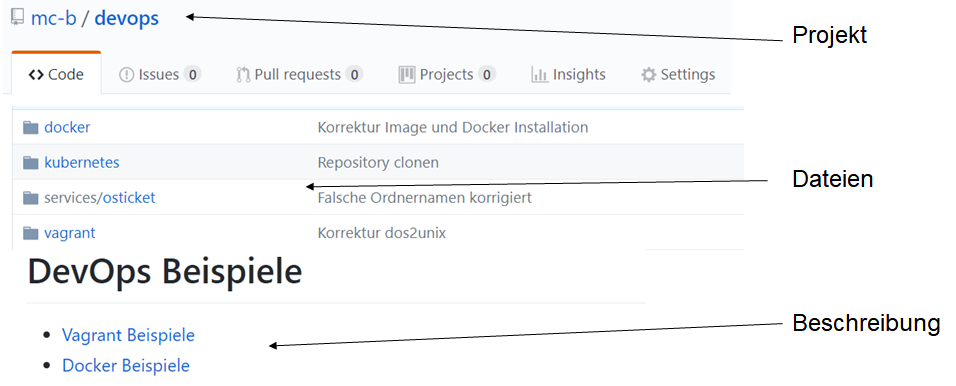

Versionsverwaltung 
------------------
***

Quelle: <a href="https://git-scm.com/book/de/v1/Los-geht%E2%80%99s-Git-Grundlagen">Git Buch</a/>

- - -

Eine [Versionsverwaltung](https://de.wikipedia.org/wiki/Versionsverwaltung) ist ein System, das zur Erfassung von Änderungen an Dokumenten oder Dateien verwendet wird. Alle Versionen werden in einem Archiv mit Zeitstempel und Benutzerkennung gesichert und können später wiederhergestellt werden. Versionsverwaltungssysteme werden typischerweise in der Softwareentwicklung eingesetzt, um Quelltexte zu verwalten. Versionsverwaltung kommt auch bei Büroanwendungen oder Content-Management-Systemen zum Einsatz.

### Hauptaufgaben

* Protokollierungen der Änderungen: Es kann jederzeit nachvollzogen werden, wer wann was geändert hat.
* Wiederherstellung von alten Ständen einzelner Dateien: Somit können versehentliche Änderungen jederzeit wieder rückgängig gemacht werden.
* Archivierung der einzelnen Stände eines Projektes: Dadurch ist es jederzeit möglich, auf alle Versionen zuzugreifen.
* Koordinierung des gemeinsamen Zugriffs von mehreren Entwicklern auf die Dateien.
* Gleichzeitige Entwicklung mehrerer Entwicklungszweige (engl. Branches) eines Projektes.

GitHub
------
***

 

- - -

[GitHub](https://de.wikipedia.org/wiki/GitHub) ist eine Webanwendung zur Versionsverwaltung für Softwareprojekte auf Basis von git. Sie bietet diverse Management und Bug-Tracking-Funktionalitäten.

Die Beispiele befinden sich auf [GitHub](https://de.wikipedia.org/wiki/GitHub) in einem GitHub Project mit dem URL: [https://github.com/mc-b/cdi](https://github.com/mc-b/cdi).

### Repository von GitHub Project clonen

Starten Sie `Bash`, setzen Mail und Username und clonen das Repository mit den Beispielen:

    git config --global user.name "<username>"
    git config --global user.email "<mail>"
    git clone https://github.com/mc-b/cdi
    
Markdown 
--------
***

    Überschrift 1
    =============
    
    Überschrift 2
    -------------
    
    ### Überschrift 3
    
    *Kursiv*, **Fett**, ***Fett und kursiv***
        
    * Ein Punkt in einer ungeordneten Liste
    * Ein weiterer Punkt in einer ungeordneten Liste
        * Ein Unterpunkt, um vier Leerzeichen eingerückt
    
    Ein normaler Absatz
    
        Ein Code-Block
        durch Einrückung
        mit vier Leerzeichen
        
- - -

[Markdown](https://de.wikipedia.org/wiki/Markdown) ist eine vereinfachte [Auszeichnungssprache](https://de.wikipedia.org/wiki/Auszeichnungssprache).

Ein Ziel von Markdown ist, dass schon die Ausgangsform ohne weitere Konvertierung leicht lesbar ist. Als Auszeichnungselemente wurden daher vor allem Auszeichnungsarten verwendet, die in Plain text und E-Mails üblich sind.

Genutzt wird Markdown vorwiegend auf Plattformen mit eher technikaffinem Publikum wie [GitHub](https://github.com/), [Stack Overflow](http://stackoverflow.com/) oder der Blogging-Plattform Ghost. Markdown wird häufig bei Readme-Dateien verwendet. 

Markdown Dateien (.md) können über die Weboberfläche von [GitLab](https://gitlab.com/) editiert werden. Alternativen sind die Wiki Erweiterungen von [Eclipse](https://eclipse.org/), der [GitBook Editor](https://www.gitbook.com/editor) oder [Visual Studio Code](https://github.com/Microsoft/vscode).

### Beispiele

* [Facebook](https://github.com/facebook)
* [Google](https://github.com/google)
* [Microsoft](https://github.com/microsoft)

### Links

* [Markdown](https://de.wikipedia.org/wiki/Markdown)
* [GitBook](http://toolchain.gitbook.com/)
* [HTML -> Markdown](https://github.com/GitbookIO/gitbook-convert)
* [GitBook Beispiele](https://github.com/showcases/github-pages-examples)

  